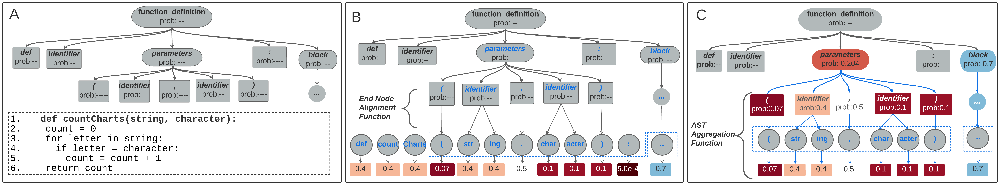

# ASTxplainer

<!-- WARNING: THIS FILE WAS AUTOGENERATED! DO NOT EDIT! -->

## What is ASTxplainer?

ASTxplainer is an explainability method specific to LLMs for code.
ASTxplainer enables both new methods for LLM evaluation and
visualizations of LLM predictions that aid end-users in understanding
model predictions. At its core, ASTxplainer provides an automated method
for aligning token predictions with AST nodes, by extracting and
aggregating normalized model logits within AST structures. Our approach
is composed of AsC-*Eval*, AsC-*Causal*, and AsC-*Viz*



The preconditions to use ASTxplainer is to have held-out testbed and a
LLM under analysis. The first step, **inference**, is to generate Next
Token Predictions of each sample in the testbed. The second,
**evaluation**, step is to compute *Cross-Entropy Loss* and our
aggregation metric AsC-*Eval*. The third step, **explainability**,
measures the causal effect of AsC-*Eval* to Cross-Entropy.

## What is AsC-*Eval*?


## What is AsC-*Causal*?


## Replication Package

### Code & Data

Below we provide links to the ASTxplainer data set and framework API.

Step 4 - install dependencies

``` sh
pip install .
```

## Empirical Results

### RQ1 AsC Performance Evaluation


### RQ2 Empirical Causal Evaluation


### RQ3 User Study on AsC Visualization


