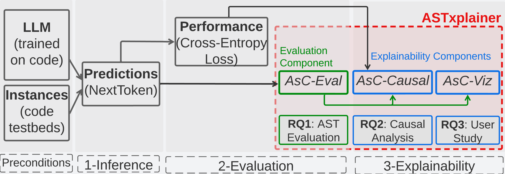

# ASTxplainer

<!-- WARNING: THIS FILE WAS AUTOGENERATED! DO NOT EDIT! -->

## What is ASTxplainer?

ASTxplainer is an explainability method specific to LLMs for code.
ASTxplainer enables both new methods for LLM evaluation and
visualizations of LLM predictions that aid end-users in understanding
model predictions. At its core, ASTxplainer provides an automated method
for aligning token predictions with AST nodes, by extracting and
aggregating normalized model logits within AST structures. Our approach
is composed of AsC-*Eval*, AsC-*Causal*, and AsC-*Viz*



The preconditions to use ASTxplainer is to have held-out testbed and a
LLM under analysis. The first step, **inference**, is to generate Next
Token Predictions of each sample in the testbed. The second,
**evaluation**, step is to compute *Cross-Entropy Loss* and our
aggregation metric AsC-*Eval*. The third step, **explainability**,
measures the causal effect of AsC-*Eval* to Cross-Entropy.

## What is AsC-*Eval*?

While LLMs have seen striking advances with regard to code generation
and other downstream SE tasks, researchers are still not able to
evaluate what aspects of code are actually statistically learned by
these models. We propose a new metric, AsC-*Eval*, to showcase the
statistical behavior of syntactic elements generated by LLMs. AsC-*Eval*
comprises the basic units for explainability (see Fig. below) as
Abstract Syntax Concepts (AsC), an alignment function $\delta$ that
links tokens with ASTs, and an aggregation function $\theta$ that
estimates the prediction performance of a terminal and non-terminal
nodes. We propose an explainability function $\varphi$ that relies on
the alignment function $\delta$ and the aggregation function $\theta$ to
perform the mapping from log-probabilites to developer-understandable
concepts. AsC-*Eval*: Left: Nodes are employed as *concepts*. Center:
Each token is aligned to the end nodes of the AST with an offset
function. Right: Node probabilities are estimated with an aggregation
function.


## What is AsC-*Causal*?

AsC-*Causal* component can be used to explain and contextualize other
canonical metrics such as the *cross-entropy loss*. To achieve that, we
propose a causal inference technique to estimate the impact of Abstract
Syntax Concepts (AsC) predictions on overall LLM performance. We can
explain the prediction performance of LLMs using AsC-*Eval* values as
treatment effects. These effects are computed from **Structural Causal
Model** (SCM), which represents our assumptions about the underlying
causal process. In our study, these assumptions take the form of the
performance of each AsC (treatments $T$), code features (confounders
$Z$), and the LLMs canonical performance (outcome $Y$). The relationship
or directionality information of these causal variables is explicitly
stated in the SCM (see Fig below). The goal of the causal analysis is to
determine the *Average Treatment Effect* (ATE) that the prediction of
AsC has on the Cross-Entropy after controlling the confounding
variables. In other words, we want to estimate the probability
$p(Y|do(T))$ to identify cases of *spurious correlations* (*i.e.,*
association is not causation)


## Replication Package

### Code & Data

Below we provide links to the ASTxplainer data set and framework API.
The code under the folder `CodeSyntaxConcept/` is organized as
follows: - AST Generation: - Aggregation Function: `aggregator.py`,
`statistics.py` - Alignment Function: - Logits (Next Token Prediction)
Generator: `extractor.py`

The API is found in this link: `github Pages` The **galeras** dataset
can be found here:

### Usage

Original empirical analysis notebooks are under the folder
`CodeSyntaxConcept/experimental_notebooks/`.

Logit extractor works with HugginFace API `CausalLMOutputWithPast`

``` python
def logit_extractor(batch, input, from_index=0):
    """
    """
    #Output is in CausalLMOutputWithPast
    CODEMODEL =  params['codemodel']
    create_folder(params['numpy_files_logits_path'])

    for idx, n in enumerate( range( from_index, len(input), batch) ):
        output = [ model( 
            input_ids = i, 
            labels = i.type(torch.LongTensor).to(device) 
            ) for i in input[n:n+batch] ] #Labels must be provided to compute loss
    
        output_logits = [ o.logits.detach().to('cpu').numpy() for o in output ]  #Logits Extraction
        output_loss = np.array([ o.loss.detach().to('cpu').numpy() for o in output ])  #Language modeling loss (for next-token prediction).

        #Saving Callbacks
        current_batch = idx + (from_index//batch)
        for jdx, o_logits in enumerate( output_logits ):
            np.save( params['numpy_files_logits_path']+ '/'+ f'logits_tensor[{jdx+n}]_batch[{current_batch}]_model[{CODEMODEL}].npy', o_logits) #Saving LOGITS
        np.save( params['numpy_files_logits_path']+ '/'+f'loss_batch[{current_batch}]_model[{CODEMODEL}].npy', output_loss) #Saving LOSS
        
        logging.info(f"Batch [{current_batch}] Completed")
        
        #Memory Liberated
        for out in output:
            del out.logits
            torch.cuda.empty_cache()
            del out.loss
            torch.cuda.empty_cache()
        for out in output_logits:
            del out
            torch.cuda.empty_cache()
        for out in output_loss:
            del out
            torch.cuda.empty_cache()
        del output
        del output_logits
        del output_loss
```

## Empirical Results

### RQ1 AsC Performance Evaluation


### RQ2 Empirical Causal Evaluation


### RQ3 User Study on AsC Visualization


