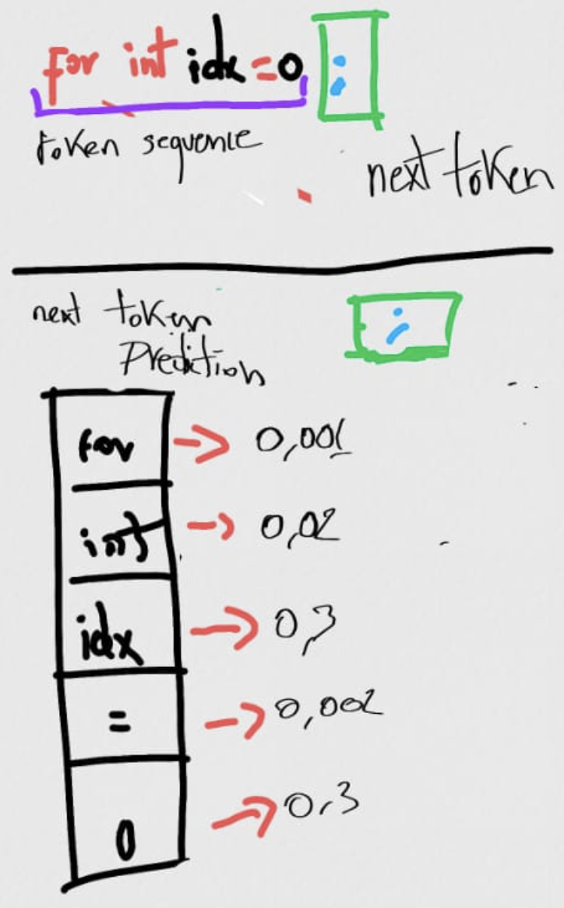
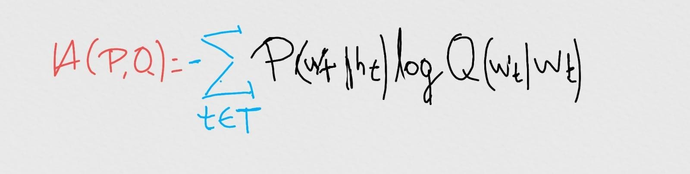
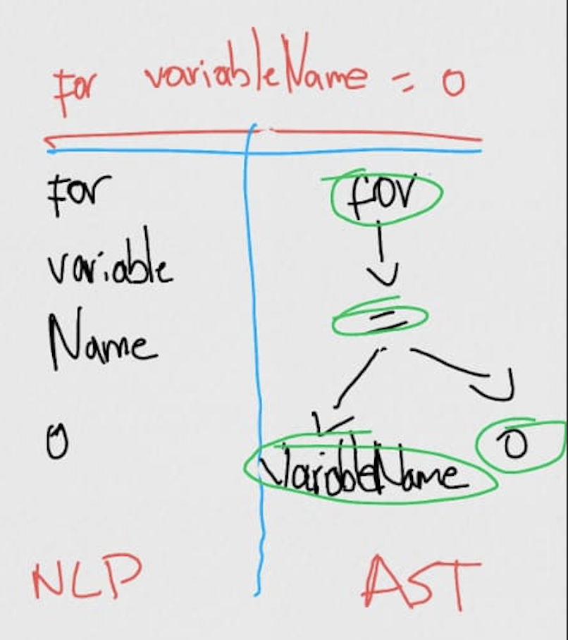
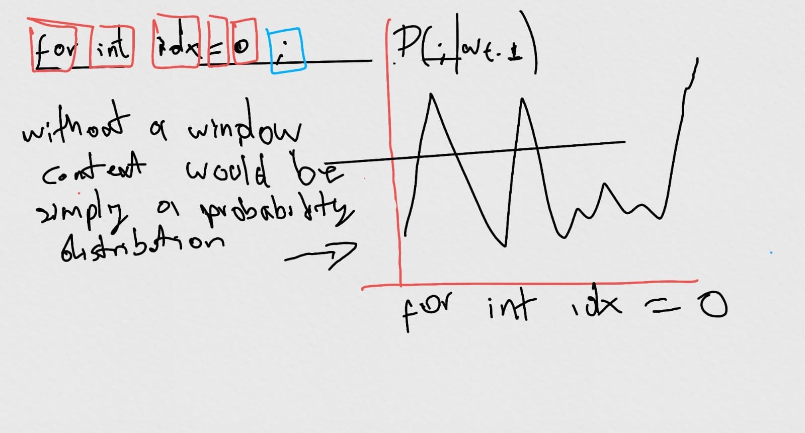
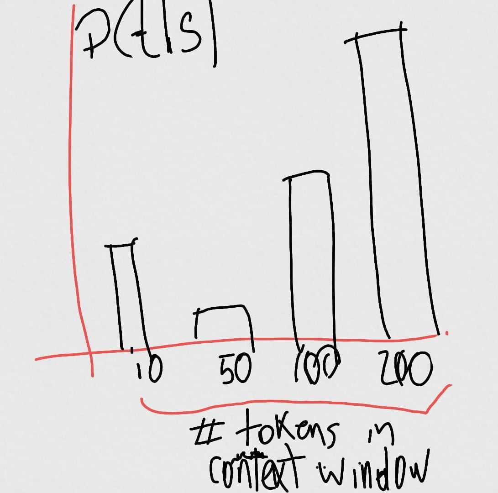

# Casual Code Capabilities

On source code prediction, when evaluating large-trained models there exist a metric called 'next token prediction'. It denotes the probability of predicting the next token on a trained model, given a defined sequence of tokens.

Given a sequence of tokens _**s**_ and the next token **_t_**, the **_P_**(**_t_** | **_s_**) represents the 'next token prediction'.

Cross-entropy, is the difference between the next token prediction and the real probability **_Q_**(**_t_** | **_s_**)

One could also calculate the average of next token prediction evaluating the model on multiple testbeds to have an idea of the model's global performance.

The closer the cross entropy is to zero, the better the model performs.

---

Cross-entropy metrics give us an accurate approximation of the global performance, however it lacks of interpretability (mas ejemplo) over large models trained for source code generation. Instead, we could propose an analysis that includes capabilities of source code like labeling position and POS tagging. 

In order to successfully perform such kind of analysis, we must overcome some challenges that are listed as follows

### Granularity of tokenizers 

Large trained models available to use in this project, had defined their own tokenizers. Those tokenizers were based on NLP rules, like punctuation removal and CamelCase separation.

If we want to evaluate how good a given model is when trying to predict the next SC token given a contextual window, we need to identify and to interpret each token in the same way as a compiler should do. For that purpose, we need to analyse the AST, syntax and grammar rules specific of each programming language and build our own tokenizer. 

### Experimentation

we need to conduct some experiments as listed below:

- Segregation or next token prediction decomposition
  - Next token should be predicted considering all the contextual window instead of the last generated token for a given sequence. At the same time, the predicted token should have a correlation with the Grammar of the programming language (e.g. loops, variable, assignation.. etc)
  - 
- Context Window
  - We need to determine how long should be the context window to optimal predictions
  - 
- Long range dependency with closure tokens 
  - How good is the model to predict closure tokens given a context window, we need to do experimentation with different setups.

Gr4c3.gm41l.9499
  ---
 
### Necessary data

| token     | prediction probability | labeling position | AST TAG     |
|-----------|------------------------|-------------------|-------------|
| for       | 0.04                   | lineno 20         | loop        |
| variable1 | 0.05                   | lineno 25         | variable    |
| =         | 0.3                    | lineno 26         | assignation |
