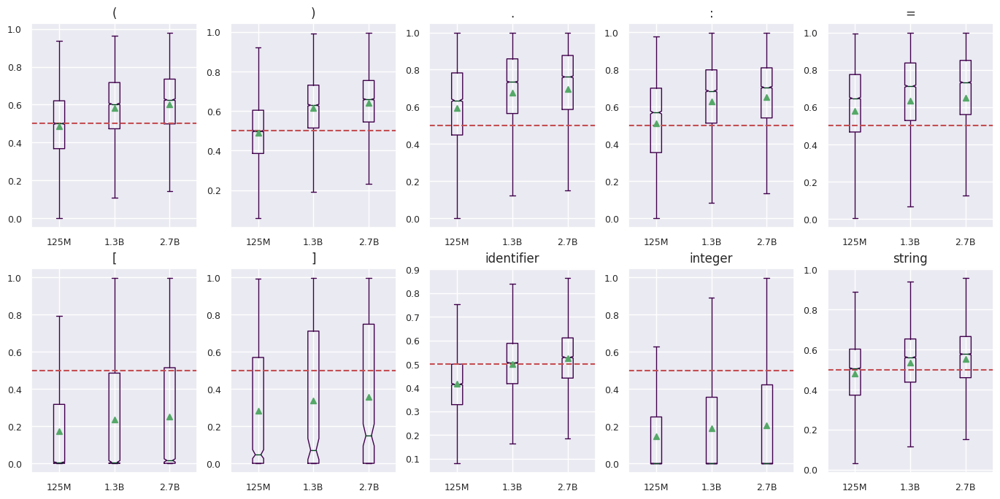

# ASTxplainer

<!-- WARNING: THIS FILE WAS AUTOGENERATED! DO NOT EDIT! -->

## What is ASTxplainer?

ASTxplainer, an explainability method specific to LLMs for code that
enables both new methods for LLM evaluation and visualizations of LLM
predictions that aid end-users in understanding model predictions. At
its core, ASTxplainer provides an automated method for aligning token
predictions with AST nodes, by extracting and aggregating normalized
model logits within AST structures.

This file will become your README and also the index of your
documentation.

## Replication Package

### Code & Data

Below we provide links to the ASTxplainer data set and framework API.

### Setup

Step 1 - create a conda virtual Enviroment:

``` sh
conda create -n CodeSyntaxConcept
conda activate CodeSyntaxConcept
```

Step 2 - install nbdev

``` sh
conda install -c fastai nbdev
```

Step 3 - build the library

``` sh
nbdev_export
```

Step 4 - install dependencies

``` sh
pip install .
```

## Results




