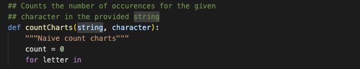
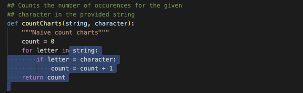
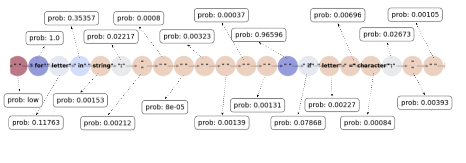

### Sample 1

Please carefully review the information presented in the three images below. The first image provides a prompt for an incomplete method, the second image displays the highlighted code (in blue) that has been generated and the third image shows the generated code explanations. Once you have reviewed all the images, please proceed to answer the questions.

Below we provide a sequence-based visualization to help answering the questions below.

-------

### Prompt

### Prediction

### Representation

-------

1. Do you see any problems (e.g., bugs, efficiency issues) in the generated source code?
    - Yes, there is a bug in the generated code
    - No, the generated code is correct
    - Other (input)

2. If the generated code is incorrect, can you explain why the model might have made the mistake? Otherwise, If the generated code is correct, can you speculate on why the model may have been able to correctly predict the above snippet?
    - (input)

3. How useful is the sequence information for interpreting or explaining the model decisions in generating the highlighted code for the above snippet?
    - Highly useful
    - Useful
    - Slightly useful
    - Not really useful
    - Not useful at all

